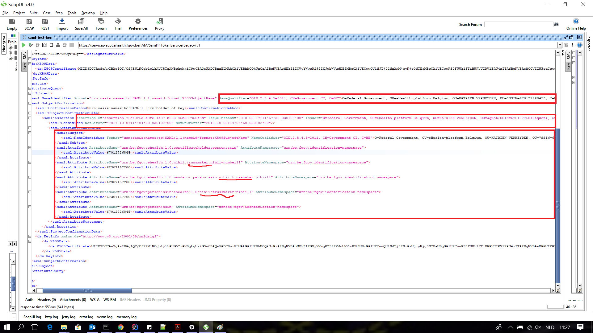

#Information about the progress on the spike for authentication:
## SOAP UI

#### We had issues with the eHealth Platform Manager connection
Issue was that the Manager isn't compatible with java 9, apparently it does work with java 8.

On [this page](https://www.ehealth.fgov.be/ehealthplatform/nl/service-ehealth-certificaten) you find the procedure : _Procedure voor het verkrijgen van een acceptatie-certificaat_

#### The steps to request & receive a SAML token: The SOAP-UI Call

* First we tried an example request. Apparently the certificate in the request wasn't valid anymore, but the response we received was not really explainable
* We replaced the expired certificate with one of ours on the eID 
* We followed [this PDF](https://www.ehealth.fgov.be/ehealthplatform/nl/data/file/view/9301938c60ff0e2ed8adab52b3ad2d6d6b1079cc?name=STS_HolderOfKey-Cookbook%20v1-2-13042018.pdf ) to compose our request in SOAP UI with the following result :

The request we used: [resources/veka_saml_request.xml](resources/veka_saml_request.xml)

##### The steps we did in SOAP-UI, visualized:

##### The response we keep getting:

## Technical connectors
* Tried to include dependencies, appears we receive no access exception
See main [README.md](README.md)

* Katrien Verheyden found a certificate link on the eHealth-page that includes the a key needed to be able to use connectors.  (https://www.ehealth.fgov.be/ehealthplatform/nl/service-ehealth-certificaten (bottom of page))